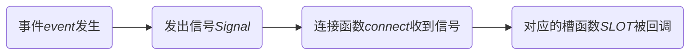

# [Qt学习](https://www.devbean.net/2012/08/qt-study-road-2-catelog/)

***

### 1、信号槽

+ 信号处理流程：



+ `QObject::connect()`常用形式：
```c++
  connect(sender, signal, receiver, slot);
```
***
>  sender：发出信号的对象（不是函数）
>  signal：对象发出的信号（**字符串**或者指向成员函数的指针）
>  receiver：接受信号的对象（省略则代表是this指针）
>  slot：接收对象在接收到信号之后需要**调用**的槽函数（**字符串(须声明为public slot)**或者指向成员函数的指针）
>
>  使用举例：
>
>  ```c++
>  QObject::connect(&button, &QPushButton::clicked, &QApplication::quit);
>  //省略了receiver，即一个QApplication对象
>  //signal和slot均为函数指针
>  ```
>
***
>  信号可以向槽函数传递数据，所以要求信号和槽函数必须类型一致（槽函数有的信号必须都有）
***
>  如果signal和slot参数是函数，可以用SIGNAL/SLOT宏来将函数名转成字符串：
>
>  ```c++
>  QObject::connect(&button, SIGNAL(clicked()),
>                       &app,    SLOT(quit()));
>  ```
>  此时只有运行时才会报错，编译时不会。

***

### 2、自定义信号槽

> ```c++
> QDebug << "";
> //Tips：QDebug相当于c++中传统的cout，会在终端显示输出
> ```

> ```c++
> class Reader : public QObject//只有继承了QObject类型的类才能用信号槽
> {
>     Q_OBJECT//继承了QObject就要添加Q_OBJECT宏
> public:
>        Reader() {}
>    
>    public slots://非函数指针调用均需要这样写
>        void receiveNewspaper(const QString & name) const
>     {
>            qDebug() << "Receives Newspaper: " << name;
>        }
>    };
>    ```

> ```c++
> class Newspaper : public QObject
> {
>     Q_OBJECT
> public:
>     Newspaper(const QString & name) :
>         m_name(name)
>     {
>     }
> 
>     void send()
>     {
>         emit newPaper(m_name);//发送信号
>     }
> 
> signals:
>     void newPaper(const QString &name);//标识信号
> 
> private:
>     QString m_name;
> };
> ```

> ```c++
> QObject::connect(&newspaper, &Newspaper::newPaper,
>                     &reader,    &Reader::receiveNewspaper);
> ```

> ​       总结
>
> + 发送者和接收者都需要是`QObject`的子类（当然，槽函数是全局函数、Lambda 表达式等无需接收者的时候除外）
> + 使用 signals 标记信号函数，信号是一个函数声明，返回 void，不需要实现函数代码
> + 槽函数是普通的成员函数，作为成员函数，会受到 public、private、protected 的影响
> + 使用 emit 在恰当的位置发送信号
> + 使用`QObject::connect()`函数连接信号和槽